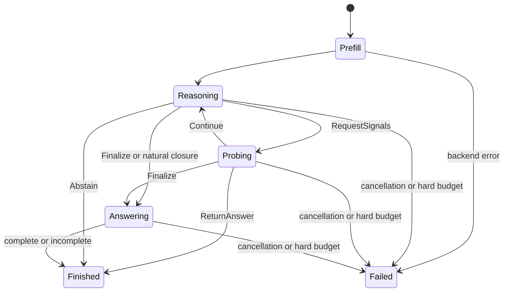

# Runtime contracts

`HaltRunner` validates configuration/capabilities and creates a private method and
backend run. `Runtime` owns event order, probes, budgets, finalization, results and
cleanup. The backend owns tokenization and model calls. The model profile owns chat
templates and answer transitions. Task adapters render inference inputs and normalize
answers; evaluation rows hold labels separately. Methods own their equations/state.

Result statuses distinguish completed, abstained, answer_incomplete, cancelled,
budget_exhausted, backend_error and method_error. `StopInfo` retains the original
method decision even when answer finalization later fails. Reasoning-only caps
reserve the answer allowance and trigger finalization. Hard resource limits can
terminate before an answer. Returning a validated probe answer counts its output
once, in its probe invocation.

Every committed synthetic/real token increments `PrefixRef.position`; forced
context suffixes do not. The next-token distribution for prefix `x[:t]` predicts
position `t`. A step event refers to the prefix **after** its committed delimiter.
ThinkBrake explicitly probes this prefix rather than reusing the distribution that
selected the delimiter. Boundary names and versions are recorded. The streaming
sentence detector is deliberately a common-protocol adaptation of methods using
NLTK sentence segmentation; it is not claimed as identical.

`ProbeResult.prefix` identifies the main prefix from which a probe branched.
`CandidateScores.frame.prefix` identifies the actual answer-scoring branch after
the model-profile suffix. Raw/processed status, coverage, tokenizer identity and
distribution domain travel with the score frame. Candidate entropy is conditional
on the candidate set; it is not calibrated correctness probability.

The reference backend pauses main generation and recomputes an isolated full prefix
for each branch. It never shallow-copies mutable KV caches. Main and probe random
generators are independent. All recomputed input, forced suffixes, generated tokens,
teacher-forced positions and observable forward calls enter an operation ledger.
This makes the reference implementation expensive but its work visible. Cancellation
is cooperative between synchronous model calls; it cannot preempt a CPU forward pass.

Configuration and metadata serialize with schema version `1.0`; plugins declare
API version `1`. Run provenance stores resolved method and backend settings, task/
prompt hashes, seeds, budgets, recipe and session initial state/update. Full trace
capture stores inputs/output only when explicitly requested. Replay refuses missing
operations rather than simulating a changed method's unavailable answer branches.

Current concrete extension consumers are signal providers and REFRAIN sessions.
Logits interventions, trained predictors and multiple-trajectory controllers remain
documented extension points, not unused runtime machinery. The initial API is
synchronous; no async server concurrency, vLLM or generic HTTP capability claims
are made.
